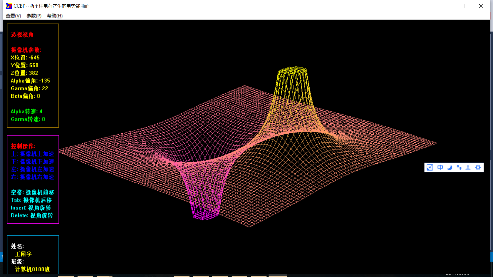
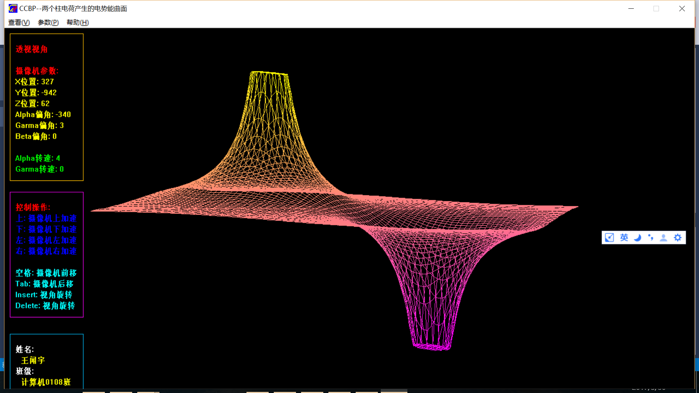
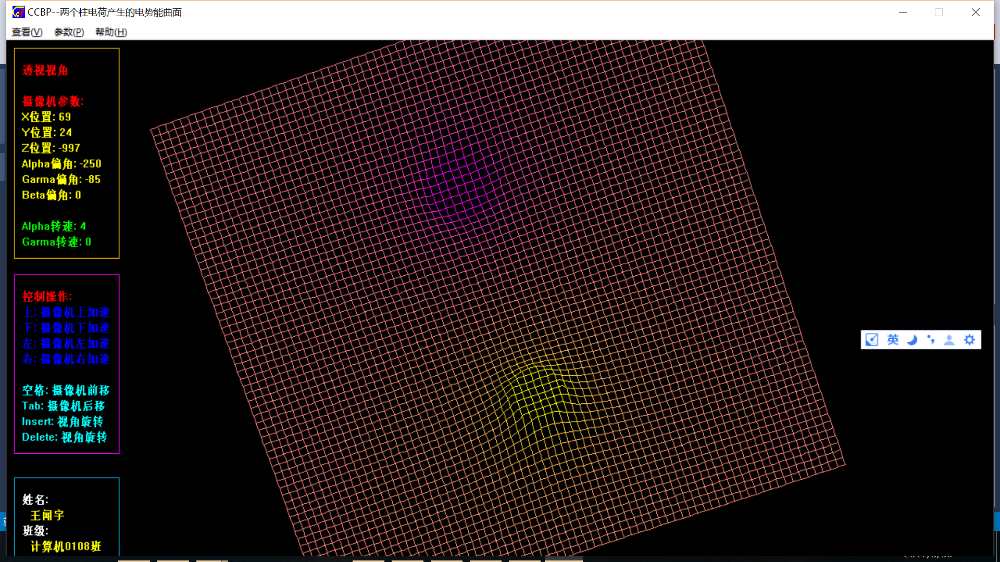

# CCBP_Practice
大学CCBP课程的课程设计，由于比较经典，我在此公开公开当时的源代码

这是3D演示程序，从不同角度去看3D图形，

整个代码我已经添加到Visual Studio2015 下运行。

运行代码需要安装DirectX9SDK。里面用到了DirectDraw的内容，没有直接使用Direct3D。所有3D投影变换都是自己用公式代码实现。

正常视角：

横视：

俯视：

